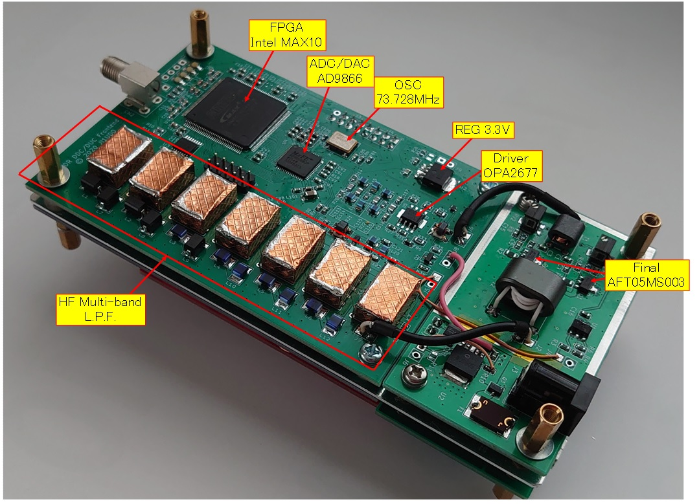

# SDR-3 transceiver improvement

## CWモード、Sメーター、ウォーターフォール表示などの機能追加
- ハードウェア製作については、[wiki](https://github.com/ji1udd/SDR-3/wiki) を参照して下さい。
- 番外: SDR-3A基板を オリジナル製作のDDC/DUC基板(回路はHerms-Lite2を参考)で置き換えてHFマルチバンダ(160M-10M) になりました。送信出力5W(2020年6月)。

https://github.com/ji1udd/SDR-3/wiki/7_SDR-3-%E3%82%92DDC-DUC%E5%8C%96/

### はじめに
- ソフトウェア開発環境の構築方法はおじさん工房のHPに掲載されています。
- 使用している SDR-3 ソースコードはトランジスタ技術 2018年 9月号 付録DVD-ROMに納められています。
- 追加作業は 各Step毎に「変更→動作確認」を行なってください。1つ前のStepのファイルを保存しておくと上手く動作しない時に変更前後のファイルの比較ができたり、手戻りが容易になります。
- 各Stepのフォルダに jpeg と txt が組で格納されています。jpeg は変更前後のファイル内容の比較結果で変更箇所を示しています。txtファイルを活用してファイルを修正します。
- トラブル回避のため、make clean を行ってから make してください。iambic.o は個別に削除するか、makefileを修正して対処してください。
- Flash Loader Demonstrator を使用して STM32に書き込みを行う際には「Global Erase」のラジオボタンを選択して下さい。

### Step1:
- おじさん工房のHPに掲載されているパッチの適用

### Step2:
- CWモード(CW Lower と CW Upper)を追加
- CW受信音が600Hzになるようにチューニングすると、LCD上に表示されている周波数が送信周波数となる。
- PTTを押すと送信となる。
- CW波のON/OFF時に窓関数は使用していない(CW波は急峻に立ち上がり/立下りする)。

### Step3:
- CWキーイング機能を追加
- CW key に PA5 を 使用。R2 に 3.3kΩを実装する。PA5は10pinのピンヘッダの脇に端子が配置されている。
- PTT で送信状態にして、PA5をGNDに落とすとCW波の送信となる。
- CW波のON/OFFは窓関数(raised cosine)を使用(CW波は緩やかに立ち上がり/立下りする)。

### Step4:
- iambicキーヤー機能を追加
- Dot key に PA5 を、 Dash key に PA6 を使用。 R3 に 3.3kΩを実装する。PA6も10pinのピンヘッダの脇に端子が配置されている。
- PA5/PA6をGNDに落とすとDot/DashのCW波が送信される (PTTの操作は不要)。
- USB端子(PA11)にSidetone信号が出力される(500Hz 矩形波)ので圧電スピーカーをつないでモニタできる。PA11と圧電スピーカとの間には直列に抵抗(1kΩなど)を入れる。
- Keyerのスピードとブレークイン時間についてメニューは未実装。変更したい場合は、 ソースコードの define の値を修正する必要がある。
- keyerフォルダをSSB_trxフォルダに入れる

### Step5:
- iambicキーヤーのSidetone周波数を600Hzに変更(受信時のトーン周波数と一致させた)
- SidetoneをオーディオコーデックIC経由のヘッドフォン出力に変更
- PA11の出力をRCのLPFを通してオーディオコーデックのIN1L/Rに入力する。
[_RC LPF Schematic_](hardware/SDR-3_SideTone.pdf)
[_Photo_](hardware/SDR-3_sidetone.JPG)
- Sidetoneの音量調整についてメニューは未実装。変更したい場合は、 tlv320aic3204.c の修正内容を変更する必要がある。
- Step5フォルダ中にあるkeyerフォルダを使う (keyerフォルダを差し替える必要あり。内容更新あり)

### Step6:
- settingメニューに、下記のiambicキーヤーの設定項目を追加
- Speed：10〜40 WPM
- Break-in 時間： 50〜500 ms (実際は、数十msの誤差あり)
- Sidetone 音量： 0 〜 117
- Step6フォルダ中にあるkeyerフォルダを使う (keyerフォルダを差し替える必要あり。内容更新あり)
- radio.c における CWモード追加時のバグ修正

### Step7:
- キーヤーにバグキー/ストレートキーの機能を追加
- settingメニューで iambic として使用するか バグキー/ストレートキとして使用するかを選択できる
- ストレートキーを使用する場合は、ストレートキーを Dash key (PA6) 側に接続する
- Step7フォルダ中にあるkeyerフォルダを使う (keyerフォルダを差し替える必要あり。内容更新あり)

### Step8:
- Transceiver 画面でキーヤーのスピードを設定できるように変更
- CW送信中は、ロータリーエンコーダ #2 の回転によりスピードが変更できる
- 受信中は、ロータリーエンコーダ #2のプッシュスイッチを(2回)押して "Keyer SPD" を選んだ後、ロータリーエンコーダ #2の回転によりスピードが変更できる
- Step8では、keyerフォルダ内容の変更はなし

### Step9:
- オフバンド時やsettingメニュー表示中にキーヤーを操作した時にSidetoneが漏れ聞こえる症状の対策
- Step9フォルダ中にあるkeyerフォルダを使う (keyerフォルダを差し替える必要あり。内容更新あり)

### Step10:
- settingメニューに CWピッチ周波数の設定項目を追加
- スペクトラム表示中に CWモード時のチューニングポイントを示す縦の赤ラインを追加
- CWピッチ周波数の設定範囲は 500Hz 〜 800Hz。 10Hz単位で変更可能
- CW受信音が好みのトーンとなるように設定するとSidetoneのトーン周波数も連動して変更される。同様にスペクトラム表示中のチューニングポイントを示す赤ラインの位置も連動して変更される。
- Step10では、keyerフォルダ内容の変更はなし

### Step11:
- CW用受信フィルタの追加
- LPF: CWモード時、600Hz, 700Hz, 800Hz, 900Hz, 1kHz の 5種類を選択した時は 8次IIRフィルタを使用する。CWモード以外の時またはCWモード時でもカットオフ周波数が2.2kHzより上のLPFを選択した場合は デフォルトの6次IIRフィルタを使用する。
- HPF: CWモード時、8次IIRフィルタを使用。CWモード以外の時は デフォルトの2次IIRフィルタを使用する。
- CWモード時、フィルタ通過帯域がわかるようにスペクトラム表示のハイライト領域が HPFの選択で変化するようにした。
- 各フィルタ係数値はお試しレベル。
- Step11では、keyerフォルダ内容の変更はなし
- バグ修正のStep26を適用してください。

### Step12:
- CW送信波の帯域幅の広がりを改善
- CW送信波の立ち上がり/立ち下り時間を従来の 5.3ms(fs=12kHz 64サンプル分)から、8ms (96サンプル分)に変更。
- Step12では、keyerフォルダ内容の変更はなし

### Step13:
- トランシーバー画面の変更。内容は下記。
- アナログタイプのSメーター表示を追加
- F.Step表示の追加
- 上記に伴い、他のメニュー項目の表示の小サイズ化
- Step13では、keyerフォルダ内容の変更はなし

### Step14:
- Sメーターの文字盤の描画方法を変更
- 横96ドット×縦47ドットのビットマップデータを使用してSメーターの文字盤を描画
- 文字盤のビットマップデータ作成ツールとしてExcelシートを使用 (firmware/S-meter Panel Data Generator/s-meter-panel_data_generator.xls)
- Step14では、keyerフォルダ内容の変更はなし

### Step15:
- Sメーターの種類として やどさんがデザインされたSメーターをタイプ1として追加。オリジナルはタイプ0。
- Sメーターの指針の色を8色(白、青、赤、緑、シアン、マゼンタ、黄、黒)の中から選択できる。
- タイプ1の場合は、Sメーターの指針の太さを選択できる(太くするのは笛吹きおじさんのアイデア)
- setting メニューでこれらのSメータータイプ、指針の色、太さを設定できる。
- タイプ1にコールサインや愛称などを表示したい場合は、Excelシート(s-meter-panel_data_generator_r1(やどさん作).xls)を使用する。フリーハンドで文字を描いても良いが、font8.cを参考にすると他部分と文字デザインが統一できる。
- Step15では、keyerフォルダ内容の変更はなし

### Step16:
- Sメーターの種類として 更に2タイプが追加。合計4タイプ。
- タイプ2は、まきのさんデザイン。Excelシートは、s-meter-panel_data_generator_r1(まきのさん版).xls (BBSの書き込み情報を元にやどさん作のExcelファイルを小変更して作成)
- タイプ3は、ぎょふんさんデザイン。Excelシートは、s-meter-panel_data_generator_r2(ぎょふんさん作).xls
- タイプ3の場合は、settingメニューで Needle bold を指定すると通常のバー表示にできる。
- ExcelシートのC言語用配列データの生成式に誤りがあった。gitにuploadしてある全てのExcelシートを修正
- Step16では、keyerフォルダ内容の変更はなし

### Step17:
- Step12の修正で混入していた下記2つのバグの修正
- メモリー読み出しのCh変更の際にLPFとHPFが正しく表示されない。
- シリアル端子に出力されるログに「ERR:lcd_draw_ch」が表示される。

### Step18:
- 送信中にメーターが動作するモードを追加。ループバック受信のTx Monitor機能を使用して実現している。
- settingメニューの TxM mode (Tx Meter Mode) で 3モードを選択できる。
- モード0 は、送信中にメーターを動作させない(OFF)モード
- モード1 は、送信中も受信時と同じパネルを使って表示を行うモード。メータースケールは、受信時と同じ -14dBu〜+100dBu。
- モード2 は、送信用のパネルを使って表示を行うモード。パネルタイプ0の例では、メータースケールを+65dBu〜+85dBuとしており、外付けリニアアンプのゲインが25〜26dBを想定したパワーの目盛り付けとなっている。
- パネルタイプ0の送信用パネル例の Excelシートは、s-meter-panel_data_generator_tx.xls
- 注意：メーターのソースコードを radio.c から分離して meter.c とした。meter.c は radioフォルダに入れること。

### Step19:
- やどさんのアイデアの電源電圧モニタ表示機能を追加。
- 電源電圧が低下した時のWarning機能を追加 (マゼンダ色で電源電圧値を表示)。
- 電圧モニタ用のADC入力として PA7 を使用。 PA7は10pinフラットケーブルコネクタの10番ピンにアサインされている。
- PA7(ADC入力)はMax. 3.3Vまでなので、電源電圧に合う抵抗分圧器を追加する必要がある。
[_VBatt Schematic_](hardware/SDR-3_VBatt.pdf)
- 電源電圧表示値の安定化のため 連続10回のADC変換結果の平均値を表示。
- settingメニューの "BattM mode" で 3モードを選択できる。
- モード0 は、電源電圧表示をしないモード(従来通り、受信レベルのみを表示するモード)
- モード1 は、電源電圧のみを表示するモード。電圧表示3桁
- モード2 は、受信レベルと電源電圧の両方を表示するモード。電圧表示2桁
- radio.c の #define の BATT_FS と BATT_LOW の値を各人の使用条件に合わせて修正すること。
- 制限事項：メーターパネルタイプ0 を選択した場合、受信レベル表示や電源電圧表示がちらつく。
- 注意: PA7には 3.3Vを超える電圧が掛からないようにすること。3.3Vを超える電圧が掛かるとSDR-3が壊れる可能性が極めて高い。フェイルセーフのためにツェナーDiでPA7をクランプするのも良い方法と思われる。

### Step20:
- SDR-3とPCソフトウェアとの連携機能を追加。CN3(UART1)端子とCI-Vプロトコルを使用。
- settingメニューで CI-V機能の有効/無効を設定。有効にするとUART1はCV-I通信用となり、無効にすると従来通りデバッグ用シリアル通信(ターミナル接続)となる。
- Turbo HAMLOG や Ctestwin に SDR-3の周波数とモード(SSB,CW,AM) を取り込める。PCソフトウェアからSDR-3の制御は未対応。
- HAMLOG対応のため UART1のボーレイトを 115200bps から 38400bps に変更(補足：SDR-3ファームウェアの書き込み時は従来通りボーレイトは自動設定される)
- CI-VプロトコルにおけるSDR-3のアドレスは 0x10 (元々はIC-275用の割り当て)。SDR-3のアドレスは、rigctrl.c の #defineで変更可能。
- Sメーターパネルタイプ3 のBoldモードにピークホールド機能を追加(ぎょふんさん作)
- Sメーターパネルタイプ0 の受信レベル表示や電源電圧表示の文字のちらつき(Step19の制限事項)を改善
- Step20フォルダ中にある rigctrl.c は radioフォルダに入れる。
- Step20フォルダ中にある meter.c を使う ( meter.c を差し替える必要あり。内容更新あり) 

### Step21:
- Waterfall表示の追加
- settingメニューで Waterfall表示のON/OFFを設定できる。ON時はスペクトラム表示が 7div表示となりスペクトラム表示下部にWaterfallが表示される。OFF時は従来通りスペクトラムが 10div表示となる。
- Waterfallの表示色は112階調で、スペクトラムの最小値(表示0dot)が黒、スペクトル値(表示dot数;Max 83)が大きくなるに従って 黒>青>シアン>緑>黄>赤>マゼンタ>白に近い色 となる。
- ロータリーエンコーダ#1のプッシュスイッチを(2回)押して "WF OFS" を選んだ後、ロータリーエンコーダ #1の回転により、スペクトラム値(表示dot数)に対する表示色のオフセットを設定できる。設定可能範囲は -20 から 100まで。
- ロータリーエンコーダ#1のプッシュスイッチを(3回)押して "WF Step" を選んだ後、ロータリーエンコーダ #1の回転により、スペクトラム値(表示1dot)に対する色諧調のステップを設定できる。設定可能範囲は 1 から 5まで。
- "WF OFS"と"WF Step"、SW1メニューの"11:SPEANA REF"を活用して好みのスペクトラム表示/Waterfall表示に設定する。
- "WF OFS"と"WF Step"で設定した値はチャンネルメモリに保存できる。
- Step21フォルダ中にある waterfall.c は SSB_trx\board\lcd\controllerフォルダに入れる。

### Step22:
- ぎょふんさん考案のスケルチ機能の追加。スケルチ機能の仕様はおじさん工房BBSのぎょふんさん投稿記事「簡易スケルチ機能」を参照のこと。
- ぎょふんさんソースコードをベースに下記の変更を加えた。
- GUIのボタン機能を使用して SQLレベルとBusy/SQLを表示。
- ミュートオン用タイマの追加。ミュートオン/オフ間の遷移条件は以下の通り。
- ミュートオフ: 信号レベルがSQLレベル以上になったらミュートオフする。
- ミュートオン: 信号レベルがSQLレベル未満となり規定時間を経過したらミュートオンする。規定時間経過前に信号レベルがSQLレベル以上となった場合は経過時間はクリアされる。
- 既定時間を変更したい場合は、radio.c 中の #define SQL_OFF_CNT 　の値 を変更する。

### Step23:
- 10ms毎の処理にて time=4 に 処理が集中していた bug を time 2〜4に処理を分散させて10ms毎処理が破綻しないように修正

### Step24:
- Step22で実装したスケルチ機能のバグ修正
- バグ症状は、「スケルチが掛かってオーディオ出力がミュートされている時にロータリーエンコーダ#2で音量調整するとスケルチが掛かっている状態(SQL表示)なのにオーディオが出力される」。
- ロータリーエンコーダ#2で音量調整した時は音量変化がわかるようにミュートを解除すると共に内部処理上もスケルチが掛かっていない状態となるように修正。
- ポップアップ表示中はSQL/Busyの表示を更新しないように修正(SQL Level調整時の表示のチラつき対策)。ポップアップ表示が終了したらSQL/Busy表示を更新する。

### Step25:
- 4ch メモリーキーヤー機能の追加
- 1メッセージの長さは最大47文字
- CWモード(CWL or CWU)時にのみ有効となる。SW5〜8を使用する。
- SWとメッセージの対応: SW5=メッセージ0, SW6=メッセージ1, SW7=メッセージ2, SW8=メッセージ3
- CWモード時にSW5〜8 を短押しすると メッセージを送信する
- CWモード時にSW5〜8 を長押しすると それぞれのメッセージのエディットモードとなる
- エディットモード時、ロータリーエンコーダ#1を回転させると文字が選択できる。ロータリーエンコーダ#2を回転させると編集位置を示すカーソルが移動する。ロータリーエンコーダ#1のプッシュスイッチを押すとカーソル位置に文字(スペース)が挿入される。ロータリーエンコーダ#2のプッシュスイッチを押すとカーソル位置の文字が削除される。
- エディットモード時に SW5〜8を短押しすると エディットモードから抜けて通常動作に戻る。
- 編集したメッセージはチャンネルメモリーに保存できる。チャンネルメモリに保存しないと電源オフにより編集したメッセージは失われる。
- チャンネルメモリーはメッセージ保存のためオリジナルの100局分から25局分に変更。
- 1チャンネル分のチャンネルメモリーにメッセージ0〜3の4メッセージが保存できるので25局のメモリーをフルに使用すると100メッセージ分保存できる。
- Step25フォルダ中にある msgedit.c は radioフォルダに入れる。
- Step25フォルダ中にある keyerフォルダを使う (keyerフォルダを差し替える必要あり。内容更新あり)

### Step26:
- Step11のバグ修正

### Step27:
- チェンネルメモリーを読み出してメモリーキーヤーメッセージに対してのみ設定する機能の追加。
- 通常のメモリー読み出しモード(SW2短押し)と異なり、周波数やモードなどは変更されない。
- メッセージエディットモード中にSW2を短押しすることでチェンネルメモリー読み出し＆メッセージエディットモード遷移する。
- 各SWによるモード遷移およびロータリーエンコーダ#1の機能、LCD表示項目については、 StateDiagram_MessageEdit_ch-Memory.pdf を参照。
- (2019.3.2) Step27のバグの対策パッチを追加。Step27_additional_patchフォルダ内の追加パッチの適用と Step27フォルダ中のkeyerフォルダを使用する。StateDiagram_MessageEdit_ch-Memory.pdfを改訂。
- メッセージ送信中にSW1/SW2を短押しするとメッセージ送信を終了する。
- メッセージエディットモード（＆chメモリー読み出しモード)中にSW5-SW8の短押し または SW1短押しで通常モードに戻る。
- (2019.3.4) PTTモードをモーメンタリに設定している場合の CWモードでの SW8長押しの際 送受信切り替えが誤動作するバグを修正。Step27_additional_patch_part2 フォルダ内の追加パッチの適用すること。補足説明：CWモード時、SW8はメッセージメモリに関する操作となり、PTTとしては機能しません。

### Step28:
- 送受信切り替え時の下記バグの修正。
- CW送信からCW受信に戻ったタイミングでCW送信開始すると送信出力がミュートされてしまうことがある。

### Step29:
- CI-V機能の拡張を行い PC から SDR-3 の 周波数/モード(SSB,CW,AM)/送受信切替 を制御できるようにした。
- settingメニューで CI-VプロトコルにおけるSDR-3のアドレス(0〜255) と PCからのCI-Vコマンドのエコーバックを行うか否か を選択できる。
- デフォルトのSDR-3アドレスを 0x94 (元々はIC-7300用の割り当て)に変更。WSJT-Xで PTT Method としてCATを選択できる機種のアドレスとしたため。
- WSJT-X : File⇒settings⇒Radioタブの「Test CAT」と「Test PTT」が Passすることを確認済。但し SDR-3は VFO B を備えていないなど制約があるため WSJT-Xの機能に制約があると思われる。
- Hamlog/Ctestwinではエコーバックなしでも動作するが、WSJT-Xではエコーバックありにしないと「Test CAT」でエラーとなる。
- Step29フォルダ中にある rigctrl.c を radioフォルダに入れる。 ( rigctrl.c を差し替える必要あり。内容更新あり)

### Step30:
- ExtPTT出力の追加。ExtPTTを使用して外部機器をSDR-3の送受信と連動させることができる。ExtPTT出力は、受信時Hi-Z、送信時"L"レベルとなる。
- PA12をデジトラ(DTC144)の入力に接続し、デジトラの出力を外部出力する。自機の場合は、オーディオインターフェイス基板上のJ2-4pinに接続。
[_External PTT Schematic_](hardware/SDR-3_ExtPTT.pdf)
- Settingメニューで ExtPTT出力を有効にするか、無効(=外部機器連動オフ)にするかを選択できる。
- 無効にすることで、ExtPTTは常に Hi-Z となるので J2にステレオイヤホン(3極プラグ)を挿して聴くことができる(PHONE-RにExtPTTが干渉しないので)。
- 有効にする場合は、4極プラグを使用する。


## その他
### Option1:
- PHASモードでSSB送信した時の変調特性の改善を図ってみた。特性の実測値については [JA3GSEさんのホームページ](http://www.ja3gse.sakura.ne.jp/SDR-3.html) をご覧下さい。
- Hilbert変換フィルタのタップ数を 127 から 255 に変更
- Hilbert変換フィルタの係数値として パスバンド 96Hz〜5904Hz (正規化周波数 0.008〜0.492) で設計した値を使用

### Option2:
- JA3GSE 辻さんから 更なる特性改善版を頂いたのでここに掲載します。特性の実測値については [JA3GSEさんのホームページ](http://www.ja3gse.sakura.ne.jp/SDR-3.html) をご覧下さい。
- 差分ファイルは Option1 からの差分
- Hilbert変換フィルタのタップ数を 511 に変更
- Hilbert変換フィルタの係数値として パスバンド 48Hz〜5952Hz (正規化周波数 0.004〜0.496) で設計した値を使用

### Option3:
- 超初心者さんアイデアの「RXゲイン設定とスペクトラム表示の連動(ex. RXゲインを上げたら信号レベルも上がる)」を実現する場合の変更箇所
- radio.c の static void rfgain_setting( void ) 内の記述を下記に変更する( -db+33 を +13 に変更 )
```c
   fft_dboffset( FFT_DBOFFSET+13 );   // 実測値に合わせ込んだ
```

- 更にスペクトラム表示の縦軸スケール(REFレベル)を連動させる場合は、下記とする。
- static void rfgain_setting( void ) 内の記述に speanaref_setting()を追加。
```c
   fft_dboffset( FFT_DBOFFSET+13 );   // 実測値に合わせ込んだ
   speanaref_setting();               // スペアナ Ref を設定
```
speanaref_setting( void ) 内の記述で スペアナRefにRXゲイン設定値も加味するように変更。
```c
   int sel =  menus[N_MENU_SPREF].sel + menus[N_MENU_RXGAIN].sel - 2 ;
```


### Appendix1:
- 付録DVD-ROMのソースに対して、main20180812.hex の settingメニューで "Freq Popup"を "OFF" にしたのと同じ動作にするための修正箇所。
- radio.c の radio_rotaryenc 中の 4箇所をコメントアウトする。
```c
   case 0:
     if( (rot>=ACCEL_TH) || (rot<=-ACCEL_TH) ) rot *= ACCEL;
     freq_setting( freq + rot*freqstep );
//   if( popuptime_default ) {
//     gui_popup_show( str_freq );
//   }else{
       gui_update();
//   }
     break;
```

### Appendix2:
- チューニング操作の早送り設定の変更
- ロータリーエンコーダの早回し判定しきい値と周波数増減量の変更箇所
- main.h の ACCELとACCEL_THを変更する。下記例は10倍速
```c
#define ACCEL             (10)          // ロータリーエンコーダー加速係数
#define ACCEL_TH          (2)           // ロータリーエンコーダー加速スレッショルド
```
